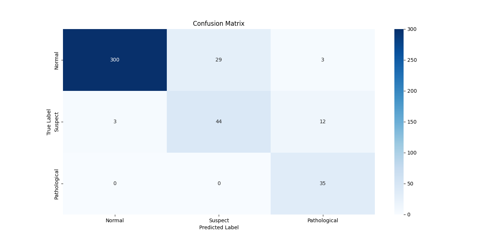
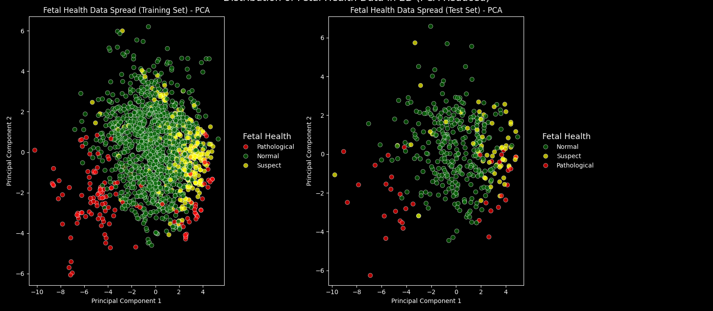
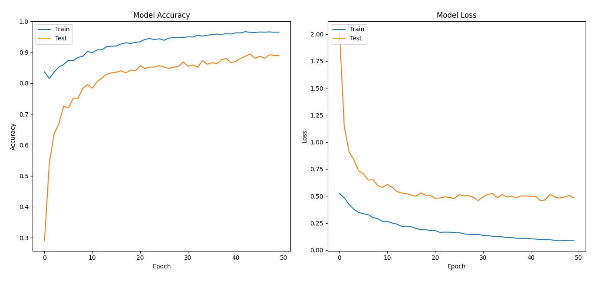

# Fetal Health Classification with Deep Learning

## Project Overview

This project focuses on building a robust classification model to predict fetal health outcomes based on cardiotocography (CTG) data. The primary goal is to accurately classify fetal health into three categories: Normal, Suspect, and Pathological, leveraging Deep Neural Networks (DNNs) with TensorFlow.

## Dataset

The dataset used is `fetal_health.csv`, which contains various features extracted from Cardiotocogram examinations, along with the corresponding fetal health status.

## Methodology

The following steps were undertaken to develop and evaluate the classification model:

### 1. Data Loading and Preprocessing

* The `fetal_health.csv` dataset was loaded using `pandas`.
* The target variable, 'fetal_health', was separated from the features.
* Target labels (1.0, 2.0, 3.0) were converted to 0-indexed integers (0, 1, 2) for compatibility with TensorFlow's `sparse_categorical_crossentropy` loss function.
* The dataset was split into training and testing sets (80% training, 20% testing) using `sklearn.model_selection.train_test_split`, ensuring stratification to maintain class distribution in both sets.

### 2. Handling Imbalanced Data

* **Observation:** Initial analysis and visualization revealed a significant class imbalance in the dataset, with the 'Normal' class being the majority and 'Suspect' and 'Pathological' classes being minorities.
    * `Normal`: ~77.85%
    * `Suspect`: ~13.88%
    * `Pathological`: ~8.28%
* **Problem:** Class imbalance can lead to models biased towards the majority class, resulting in poor performance (especially low recall) on critical minority classes.
* **Solution:** To address this, the **SMOTE (Synthetic Minority Over-sampling Technique)** algorithm from `imblearn` was applied to the **training data only**. SMOTE generates synthetic samples for the minority classes to balance the dataset. This step was performed *after* the train-test split to prevent data leakage.

### 3. Feature Scaling

* All numerical features were scaled using `sklearn.preprocessing.StandardScaler`. This is crucial for DNNs as they are sensitive to feature scales, which can impact convergence and performance. Scaling was applied *after* SMOTE on the training data and then transformed on the test data.

### 4. Feature Selection

* **Necessity:** While not strictly mandatory, feature selection helps reduce dimensionality, speed up training, mitigate overfitting by removing irrelevant/redundant features, and improve model interpretability.
* **Method Chosen:** **`SelectKBest` with `f_classif` (ANOVA F-value)** was employed as a filter method to select the top `k` most statistically significant features. This was applied *after* the train-test split and *before* scaling, fitting only on the training data.
    * *(Alternative explored: Feature importance from `RandomForestClassifier`)*

### 5. Model Building (Deep Neural Network - DNN)

* A sequential Deep Neural Network (DNN) model was constructed using TensorFlow's Keras API.
* **Architecture:**
    * **Input Layer:** A `Dense` layer matching the number of selected features.
    * **Hidden Layers:** Multiple `Dense` layers (e.g., 128, 64, 32 neurons) with `ReLU` activation functions for non-linearity.
    * **Dropout Layers:** `Dropout` layers (e.g., 0.3 rate) were included between hidden layers to prevent overfitting by randomly dropping units during training.
    * **Output Layer:** A `Dense` layer with `num_classes` (3) neurons and a `Softmax` activation function, which outputs probabilities for each fetal health class.
* **Compilation:**
    * **Optimizer:** `Adam` (a popular and effective adaptive learning rate optimizer) was used.
        *(Alternative explored: SGD - Stochastic Gradient Descent)*
    * **Loss Function:** `sparse_categorical_crossentropy` was chosen as the loss function, suitable for integer-encoded classification labels.
    * **Metrics:** `accuracy` was monitored during training and evaluation.

### 6. Training and Evaluation

* The DNN model was trained on the **SMOTE-resampled and scaled training data** for 50 epochs with a batch size of 32. A 20% validation split was used to monitor performance during training.
* The model's performance was evaluated on the **original (un-resampled) and scaled test data**.
* In addition to overall accuracy, a detailed `classification_report` (including precision, recall, f1-score for each class) and `confusion_matrix` were generated to provide a comprehensive understanding of the model's performance across all classes, especially the minority ones.

---

## Visualization

To understand the data's distribution, relationships between features, and model training progress, several visualizations were created:

### Feature Correlation Heatmap

This heatmap illustrates the correlation matrix of the dataset's features, helping to identify highly correlated features and their relationships with the target variable.



### 2D Data Spread (PCA-reduced, Matplotlib)

This plot shows the training and test data points reduced to two principal components, color-coded by fetal health category, providing a flat view of their separation.




### 3D Data Spread (PCA-reduced, Plotly)

This interactive 3D plot provides a deeper insight into the distribution of the SMOTE-resampled training data and the original test data in a 3-dimensional space (after PCA to 3 components).

[Link to Hosted 3D Plotly Visualization](https://sreena-dev.github.io/Fetal_Health_ML/fetal_health_3d_pca_interactive_2.html)

### Training and Validation Curve

This graph visualizes the training and validation loss/accuracy over epochs, indicating the model's learning progress and helping to detect overfitting or underfitting.


---

## Results and Impact

The initial model achieved an approximate accuracy of **91%** on the test set. By incorporating SMOTE for handling class imbalance, the model's ability to correctly classify minority classes (Suspect and Pathological) was significantly improved, as evidenced by enhanced recall and F1-scores in the classification report, leading to a more reliable and robust diagnostic tool for fetal health.



---

## How to Run

1.  **Clone the Repository:**
    ```bash
    git clone <your-repository-url>
    cd <your-repository-name>
    ```
2.  **Place the Dataset and Images:** Ensure `fetal_health.csv` is in the root directory. Create an `outcomes` folder and place `heatmap.png` and `train_test graph.png` inside it.
3.  **Install Dependencies:**
    ```bash
    pip install pandas numpy tensorflow scikit-learn imbalanced-learn plotly matplotlib seaborn
    ```
4.  **Run the Script:**
    Execute the Python script containing the full pipeline. The 3D Plotly graph will be saved as `fetal_health_3d_pca_scatter.html` in the same directory.
    ```bash
    python your_main_script_name.py # Replace with the actual name of your Python file
    ```
